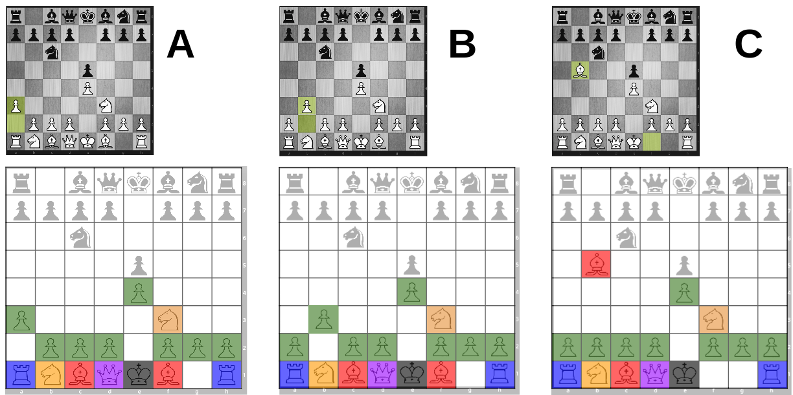
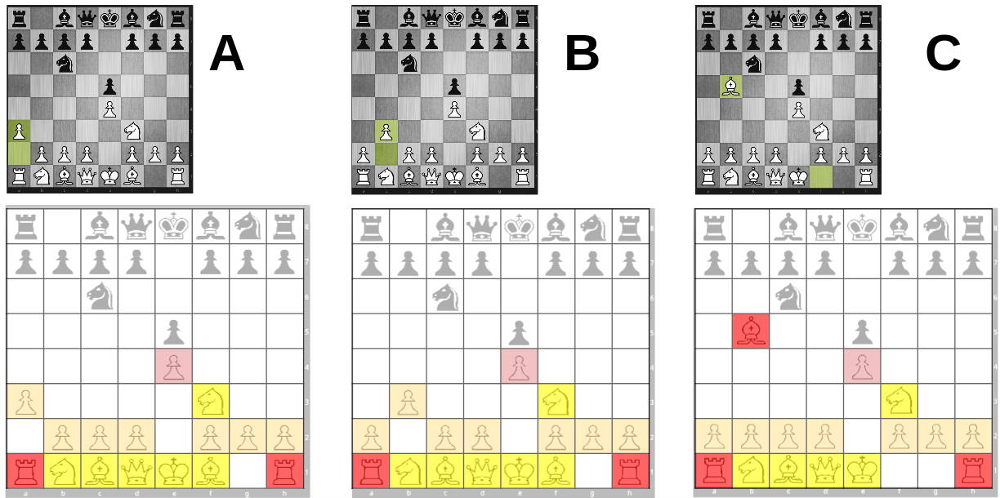
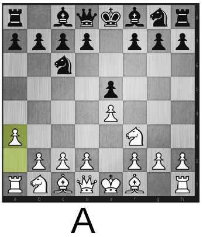
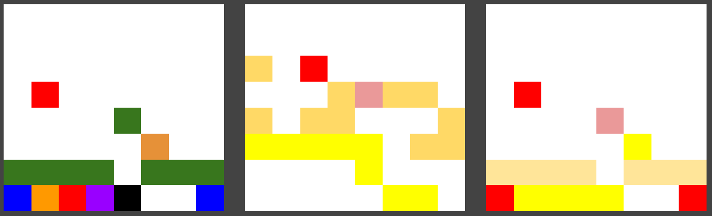

# chess_computer_perception
A curious method for creating computational chess intuition for "similar" positions through perceptual heshes (for pruning).

## Motivation 

This project is inspired by Matthew Lei's paper [Giraffe: Using Deep Reinforcement Learning to Play Chess](https://arxiv.org/abs/1509.01549) - specificially section 7.1.4 under 'Future Work':

> ## 7.1 Future Work
> ### 7.1.4    Similarity Pruning
> Although  Giraffe  already  has  much  smaller  search  trees  than  other  engines  of  similar  strength, they are still many orders of magnitudes larger than what humans can achieve.  One of the causes for the difference is in how accurately positions are evaluated.  When positions are not evaluated accurately, deeper and wider searches are required to compensate.  Closing this gap has been the primary focus of this project.
>
> Another reason for humans’ high search efficiency is the concept of position similarity.  Humans can often decide that some moves are effectively equivalent in some situations, and avoid searching all of them.  This dramatically reduces the average branching factor of search trees.
>
> One possible way to implement this using machine learning is to use a neural network that takes positions  as  inputs,  and  outputs  sequences  of  numbers  that  can  work  as  ”signatures”  for  each position.  Unsupervised learning (for example,  clustering) can then be used on the signatures to gauge degrees of similarity between positions.  However,  it is unclear how such networks can be trained.
>
> Being able to accurately predict equivalence between positions and moves, whether using machine learning or other techniques (such as inductive reasoning), is likely going to lead to another major milestone in achieving more efficient searches.
>

Here is an approachable (less-technical) summary of the arXiv Giraffe paper by the [MIT Technology Review](https://www.technologyreview.com/s/541276/deep-learning-machine-teaches-itself-chess-in-72-hours-plays-at-international-master/).

## Scope

The goal of this project is to generate a "signature" for different positions, such that similar positions have similar signatures (as per section 7.1.4). Position evaluation is not currently within scope, which is already nicely tackled with Giraffe.

*(although one could imagine using the signatures, or features selected/extracted from the signatures, as inputs to an evaluation engine. For example, Giraffe might have another block of inputs receiving signature-derived data,  effectively adding a fuzzy-ish memory for recognizing common themes through different positions. There would be redundancy with some of its current input data, so degree of information-content added is unclear).*

## Approach

Given a board position, generate an appropriate visual representation (e.g. 1 or more PNG images) that encodes the salient features, then send through a perceptual hash function to generate a string that serves as the "signature".

## Example Posotions

*(Note, in retrospect, this isn't the greatest example set, since there's a dark-square bishop mobility difference, but it still illustrates the approach adequately).*

Suppose a game begins: 
```
1. e4 e5
2. Nf6 Nc6
```
And now the computer, playing white, wishes to consider whether any of the moves `{3. a3, 3. b3, 3. Bb5}` are similar to each other.


### Visually encoding 

Each piece is encoded by a color.

Note: There is no need to distinguish individual pawns or the kingside versus queenside knight, since swapping two pawns results in a perceptually-identical board. 

Also note: The hash function does not need to know the meaning of the colors. The scope of this project is not position evaluation, only whether two positions are significantly different. In most cases (beginning & middle game), moving a major pieces will result in a significantly different board (reflected in the attack & defense encodings below) regardless of whether it was a knight or bishop that was moved. The color --> piece legend/key is superfluous information for this task.

(Note, pieces overlaid on the color charts are simply for convenience scanning the README)

(Also, see note at bottom about irrelevance of the position hash)




### Visually encoding attacks

In this rough draft, attacks are represented as such:
-  Yellow tiles for empty squares being attacked by white (bright yellow = multiple attackers)
-  Red tiles represent enemy pieces under attack (pale = pawn, bright = piece)
-  *(Border width difference pending removal)*


### Visually encoding defenses

Defenses are colored separately from attacks:
-  Yellow represents defended pieces (pale = pawn, bright = piece)
-  Red reperesents undefended pieces (pale = pawn, bright = piece)
-  Border width correlates with number of defenders

*(Warning: rightmost panel contains some incorrectly-colored squares, whoops. To be fixed)



Note: tentative application of `dhash` would likely not work great with border width for passing information, so this may need to change. 

### Desired features

-  Piecewise board balance: color each square by (# white pieces attacking)-(# block pieces attacking), using shades of blue for winning squares and shades of red for losing squares. Variations could take into account value of the respective pieces. 

-  Colorful representation of features such as pins, absolute pins, forks, checks, discovered checks, batteries (e.g. Q on d1, R on d2), whose existence can be relevant distinguishing positions as significantly non-similar.

## Application of perceptual hash

### Human-aid visual cues removed
The various repsentations will be presented to the perceptual has function without visual aides of borderlines and piece silhouettes (which would be lost in downsampling).

### Example position

For example, consider the full representation of position A:



*(left to right: positions, attacks, defenses)*



### One hash or multiple?

One could combine all of the representations (as above) and feed that entire image through a perceputal hash function. In that case, it would be necessary to take care to tweak the downsampling to a minimum of (8 px * 24 px) instead of the common default (8 px * 8 px).

On the other hand, each representation could be hashed separately (first 8 x 8 positions, then 8 x 8 attacks, etc...) and their strings concatenated. This provides better control for potentially weighting different features as signifying meaningful difference (for example slight variations in the position hash can be interpreted as more significant if there are strong variations in the attack or defense hashes).

### Notes

1) Converting an 8 x 8 board into an image, to be read in by a hash function and downsampled to an 8 x 8 matrix includes a slightly unnecessary detour. A more direct approach would be to modify a perceptual hash library to directly accept numeric matrices encoding the various features.

`FEN (board position) --> numeric matrices encoding various features --> perceptual hash fxn --> signature`

2) In the strict scope of this project (determining the similarity of positions that result from various candidate moves, for pruning purposes), hashing the position is unnecessary. The positions being compared will always be similar-ish, with one piece being moved; demonstrating this with a hash is unnecessary. The action is all in the hash representations of other components.
